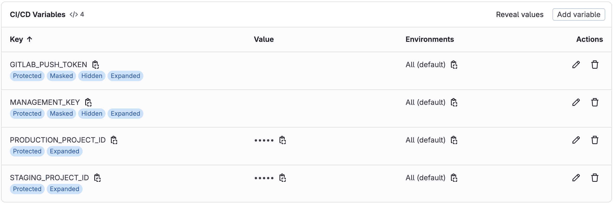

    
    <h3 align="center">Descope CI/CD Template</h3>
  

    A template repo for managing your Descope project using snapshots
  

## About

This GitLab CI/CD pipeline provides a working solution for deploying changes to your production Descope project using snapshot export and import features.

You can use this pipeline to:

* Keep a source controlled copy of your project settings and configurations
* Use a manual job to export snapshots from a staging project and create a merge request
* Code review changes in merge requests before they are approved and merged
* Automatically deploy changes after merge requests are merged to import them into your production project

**Important:** The pipeline configuration is in the `.gitlab-ci.yml` file in the root of your repository.

 

## Getting Started

### Prerequisites

1. You'll need a Descope project and its `Project ID`, which you can find in the [Project page](https://app.descope.com/settings/project) in the Descope console.
2. The instructions below assume you have another Descope project, and they'll be referred to as the `staging` and `production` projects.
3. You'll also need to generate a management key in the [Company page](https://app.descope.com/settings/company/managementkeys).

### Configuration

The pipeline needs access tokens and project IDs to work with both GitLab and Descope APIs.

1. Create a **Project Access Token** (preferred) in **Settings → Access Tokens** or **Personal Access Token** in **User Settings → Access Tokens** with `write_repository` and `api` scopes.
2. In your project's **Settings → CI/CD → Variables**, add these variables:
   - `GITLAB_PUSH_TOKEN` - Your Personal Access Token
   - `MANAGEMENT_KEY` - Your Descope management key
   - `STAGING_PROJECT_ID` - Your staging Descope project ID
   - `PRODUCTION_PROJECT_ID` - Your production Descope project ID

 

    

 

## Usage

1. Create a new Gitlab project.
2. Click **Build → Pipeline editor** and select **Configure pipeline**.
3. Copy the content of the `.gitlab-ci.yml` file to the text editor and commit the change.
4. A `validate_and_deploy` job will automatically run without changes. At first, the repository will be empty (Except the `.gitlab-ci.yml` file). We'll want to get the current state of the Descope project into the repository.
5. Go to **Build → Pipelines** in your GitLab project.
6. Click **"New pipeline"** → Select **main** branch → **"New pipeline"**.
7. Click the **▶️ play button** next to `export_and_create_mr`.
8. After a short while, a new Merge Request will be created.
9. You can confirm that the added files contain your `staging` project's settings and configurations.
10. Approve and merge the Merge Request to trigger an automatic deployment into your `production` project.

You should now see a `ProjectSnapshot` folder in the repo with files representing all the settings and configurations of your project.

 

You can now try to introduce a small change to your `staging` project by going to the Descope console and changing a setting. After that you can repeat the steps above and observe that the diff in the created Merge Request reflects the change that you made.
